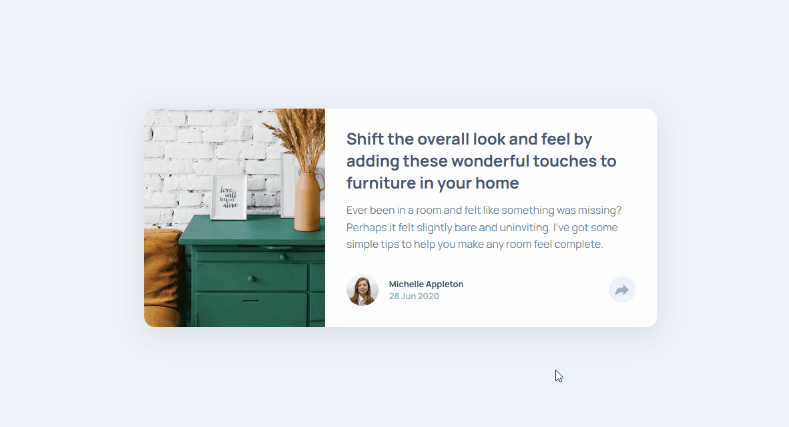

# Frontend Mentor - Article preview component solution

## Table of contents

- [Screenshot](#screenshot)
- [Links](#links)
- [Built with](#built-with)
- [Author](#author)

### The challenge

Users should be able to:

- View the optimal layout for the component depending on their device's screen size
- See the social media share links when they click the share icon

### Screenshot

### Links

- Solution URL: [Frontend Mentor](https://www.frontendmentor.io/solutions/article-preview-component-react-sVLoQ0Xc8)
- Live Site URL: [Vercel](https://preview-article-component.vercel.app/)

### Built with

- CSS custom properties
- Flexbox
- [React](https://reactjs.org/) - JS library

## Author

- Frontend Mentor - [@popescudragos](https://www.frontendmentor.io/profile/popescudragos)
- LinkedIn - [@ospop](https://www.linkedin.com/in/ospop/)
